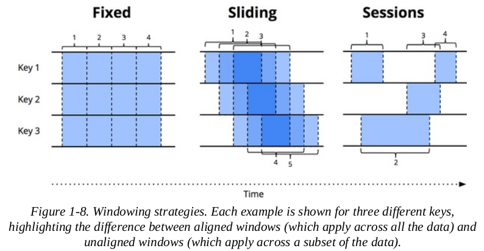

## Terminology

- **Bounded / Unbounded Data**: bounded data is dataset with finite size, unbounded data is dataset with infinite size

- **Streaming System**: a data processing system built for unbounded data.

- **Stream**: a sequence of potentially unlimited data elements made available over time.

    E.g. network packets captured over a device, mouse movement of a user on a webpage over time.

- **Event time**: The time at which events actually occured.

- **Processing time**: The time at which events are observed in the system.

    It's always true that `processing time >= event time`.

    Note that, in real life, there is a skew between event time and processing time, and this skew is a highly variable function of many factors, including

    - shared resoure limitations

    - software causes, such as contention, distributed system logic

    - feature of data

## Data Processing Patterns

An overview of various data processing patterns. This book will focus on unbounded data (streaming).

### Bounded Data

A finite set of data. Typical data processing engine for bounded data includes MapReduce, Spark, etc.

### Unbounded Data (Batch)

To process unbounded data in a batch processing engine, we could slice up the unbounded data into a collection of bounded datasets, and process each slice as a bounded data.

There are two ways to do such slicing.

#### Fixed Windows

Group data by a fixed time window, and process each window as a bounded data. E.g. Group data by 1-hour window.

#### Sessions

Group data by features of data. A classic example is network session, where network packets are grouped by period of ativitiy for a certain user. Data from different users belongs to different sessions, data from same user but separated by periods of inactivity also belongs to differnet sessions. A more concrete example would be network packets grouped by source and destination IP address, where the gap between each packet is no longer than 10 minutes.

Calculating sessions using a batch engine could be problematic, since you often end up with sessions that are split across batches.

### Unbounded Data (Streaming)

For unbounded data, we face several difficulties

- the data is unbounded: its size could be infinite

- the processing time of data is highly unordered w.r.t. event times.

    If you care about event time, you would need some sort of time-based shuffle (reordering of data) in your pipeline.

- the data are of varying event-time skew

    The event-time skew can range from miliseconds to days. You can't just assume a bound on the gap between event time and processing time.

#### Time-Agnostic

This is the class of data where time doesn't matter. For example, calculating the average of temperate across the day. All streaming engines supports time-agnostic use cases.

Types of time-agnostic use cases includes

- Filtering

    E.g. you are capturing web traffic log and only want to keep traffic from a certain domain. You could do the filtering as the data arrive, without even looking at its arriving time.

    It doesn't matter if the data is unbounded, unordred, and of varying event-time skew.

- Inner Joins

    When joining two unbounded data sources, you can simply buffer value from one source as they arrive, and do the joining when value from another source arrive.

    Although there is a problem about completeness: you can't guarantee if all data from one side of join has arrived. This can be mitigated (but not sovled) with a timeout.

This won't be the focus of the book.

#### Approximation Algorithms

When you only need approximated results, such as approxiamted max of rps, you could use an apprixmation algorithms like approximate Top-N or streaming k-means. 

One catch is that these algorithms are usually based on processing time, not event time.

This also won't be the focus of the book.

#### Windowing

There are three types of windowing strategies

- Fixed Windows

- Sliding Windows

- Sessions