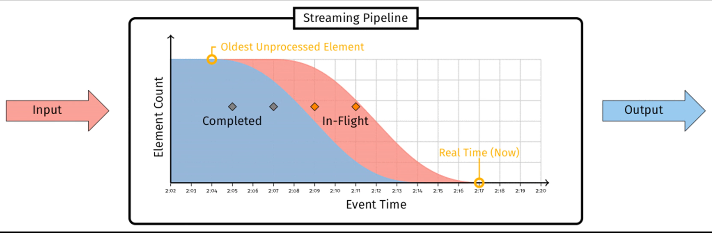

A **streaming pipeline** is a directed graph with a collection of sources and sinks. Each node in the DAG is called a **stage**. There are three types of stages:

- source: nodes that generate messages. E.g. a node that captures user click position on a webpage.

- internal node: nodes that receives message from upstream nodes (in neighbor), do some processing, and output results to downstream nodes (out neighbor). E.g. a node that sum up input values of same key within every 10-second window.

- sinks: nodes that consume results, e.g. a node that writes input to a file.

A stream of input messages are continuously generated from sources in time, flows through internal nodes, and output at sinks as a stream of output messages.

We make the assumption that **each message has an associated logical event timestamp when created at source node**. This is usually the time of event occurrence.

We can plot the distribution of event timestamp of messages in the streaming pipeline at a certain time

Within a streaming pipeline, there are two types of messages

- in flight: received but not fully processed

- completed: no more processing is needed

To recap,

> A **watermark** is a monotonically increasing function \(f(P) \to E\) that maps from processing time (ingress time) \(P\) to event time \(E\), meaning that **all events before event time \(E\) should arrive at processing time \(P\)**.

  Note: The monotonicity within each log file is only possible when the event timestamps within the file are assigned as data are written to it. For example, a web frontend that logs event directly into Kafka can take the event time as the time when data is written.

A message is **late** if its event time is greater than the watermark of its processing time, i.e. \(E_{msg} > E_{watermark} := f(P_{msg})\) where \(E_{msg}\) is message event time, and \(P_{msg}\) is message processing time.

> Note: we will use the term "processing time" and "ingress time" interchangeably.

## Examples of Watermark

### Examples of Perfect Watermark

Perfect watermark has no late message. It's not really practical unless in specific cases, such as

- A source that assign ingress time (processing time) as event time. Just use identity function as watermark. Easy but useless.

- Static sets of time-ordered logs

  Consider a set of files where

  - Logs are appended to the files as time passes. Within each log file, the event time of logs increases monotonically, but there is no relationship of event times across files.

  - The number of file is fixed across time.

  Each file can maintain the oldest event time among unprocessed messages, which we will just call "oldest unprocessed event time".

  E.g. a kafka topic (a stream of message) with a fixed set of partitions (subdivision of the topic, treated as a file), where logs added to each partition contain monotonically increasing event timestamp. E.g. If we have three partitions at a specific ingress time T as follows

  | Partition | Oldest Unprocessed Event Time |
  | --------- | ----------------- |
  | 0         | 105               |
  | 1         | 100               |
  | 2         | 110               |

  The watermark of ingress time T is simply the oldest event time among all unprocessed messages in all partitions, which is 100 in this case.

  The monotonicity of event time within each log file is only possible when the event timestamps are assigned as data are written to the file. For example, a web frontend that logs event directly into Kafka can take the event time as the time when data is written.

  > Note: We can relax this setup by having a set of files where
  >
  > - same monotonicity within each log file
  >
  > - number of log files changes over time, but newly added log file must have oldest unprocessed event time larger than the watermark (i.e. the oldest event times among all unprocessed events of all log files) at any given prior time.
  >
  > The second condition is usually guaranteed by construction: e.g. in the kafka example above, we may add a new partition at a certain time, and start writing logs to it. Since we use write time as event time, our event time must be greater than write time of all previous logs.

### Examples of Heuristic Watermark

Heuristic watermark only provide an estimate of the smallest event time of unprocessed events. It can have late data, and we need additional mechansim to handle late data. Examples of heuristic watermark are

- Dynamic sets of time-ordered logs:

  Consider a set of log files where

  - Logs are appended to the files as time passes. Within each log file, the event time of is monotonically increasing. But there is no relationship of event times across files.

  - Number of files is changing across time, and newly added file might contain oldest unprocessed event time smaller than previous watermark.

  We can construct a heuristic watermark using the oldest event time among all unprocessed messages among all files, combined with external information like network topology, bandwidth availbility, etc.

- Google Cloud Pub/Sub

  Pub/Sub makes no guarantee on in-order delivery: even if a single publisher publishes two messages, there is a small changes these two messages are delivered out of order. In exchange, Pub/Sub can scale up to very high level of tput with zero user intervention.

  For details, see later section that does a case study of Cloud Pub/Sub.

## Watermark Propagation

Perfect or heuristic, watermark will propagate through the pipeline: a perfect watermark will remain perfect downstream, and heuristic watermarks will remain as heuristic as they were when established (same late data through the pipeline). The key is that **we can reduce the complexity of tracking completeness in a pipeline to the problem of creating a watermark at the source**.

For heuristic watermark, later stages will have a more conservative watermark (i.e. later in time), because earlier stages may aggregate data, and there will be less input to later stages.

At any time, each stage has two watermarks

- **input watermark**: For a sources stage, this is created by a source-specific function. For a non-source stage, this is defined as the minimum of the output watermarks of all its upstream stages. This captures the progress of upstream stages.

- **output watermark**: This is defined as the minimum of the stage's input watermark and all non-late active messages within the stage. The exact definition of active depends on the operation of the stage. Typically, this includes

  - data buffered for aggregation but not yet materialized downstream

  - pending output data in flight to downstream stages

  This captures the progress of the stage itself.

> The definition may appear circular, but it actually goes like this: input watermark of source -> output watermark -> input watermark of non-source.

For each stage, the difference between its output watermark and input watermark is the **delay** introduced by this stage. For example, a stage that aggregates every 10-second window would have a delay no smaller than 10 seconds.
