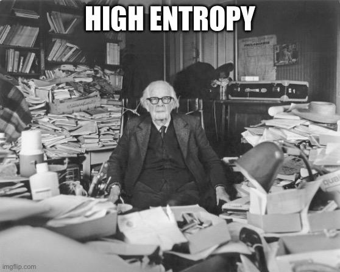

What is entropy? In one line, **entropy is a measure of the amount of information**. But what does that means? In specific, we may ask

1. What is information, or what entity has information?

2. Can one entity has more information than another? What does that even mean?

Intuitively, we think of **information** to be **the amount of surprise**, and say something has much information if it's surprising. For example, let's say your are chatting with your friend Alice. She tells you two things

1. The sun will rise tomorrow.

2. There will be a rare meteor shower happening tonight.

The first one is pretty predictable, you don't need someone else to tell you to know that. It's *not that surprising*, It carries *little information*.

The second one is *quite surprising*, it doesn't happen every night. It would be natural to say the second sentence conveys *much information*, much more than the first one.

To formalize this intuition, we need to use probability theory. Formally, both *events* and *random variables* can have information, although they are defined by two different concepts. We will first define information for event, and see how we can obtain the definition of information for random variables.

## Event and Information Content

Given an event \(A\) and a probability measure \(p\), we want to define a function \(I(A)\) that could represent "the information of \(A\)". 

For event, what does "surprise" mean? An event is surprising if it happens at very low probability: it's indeed surprising if something very unlikely happens. Using our previous example, we may have \(p(\text{sun will rise tomorrow}) = 1\) while \(p(\text{there will be a meteor shower tonight}) = 0.0001\).

Before giving the actual definition of \(I(A)\), let's think about how this function should behave. It would be natural to require \(I(A)\) to satisfies these three properties

1. *If we know for sure an event will happen, the event should carry no information at all*. 

    Formally, for event \(A\)
    \[
        p(A)=1 \Rightarrow I(A) = 0
    \]

2. *The more surprising an event is, the more information it carries*. 

    To put it another way, if an event is more surprising than another event, it should carry more information. 

    Formally, for event \(A\) and \(B\),
    \[
        p(A) < p(B) \Rightarrow I(A) > I(B)
    \]

3. *The information of two independent events should be summable*.

    This one might be a bit confusing. Take an example, consider event \(A =\) "this coin flip will give a head" and event \(B =\) "all eight planets will align tomorrow". These two events are completely unrelated. Now consider another event \(C = A \cap B = \) "coin flip to head and all eight planets align". The amount of surprise of \(C\) should naturally be the sum of the surprise of \(A\) and \(B\).

    Formally, for event \(A\) and \(B\),
    \[
        p(A \cap B) = p(A) \cdot p(B) \Rightarrow I(A \cap B) = I(A) + I(B)
    \]

In fact, these properties can already uniquely define information content \(I(A)\). Using some smart math proof, we can show that only the following family of functions can satisfy all these three properties
\[
    \log_a{\frac{1}{p(A)}}, a > 0, a \not = 1
\]

The base \(a\) can be any positive number except 1. In this blog, let's just take \(a=2\) since a bit can be either 0 or 1. Informally, the root cause of this choice is that we want to encode distribution using bits. With base 2, we can use $I$ measures the number of bits needed.

Now, we can give the formal definition of information for an event:
> Given probability measure \(p\) and event \(A\), we define the **information content** of event \(A\) to be 
\[
    I(A) = log_2(\frac{1}{p(A)})
\]

## Random Variable and Entropy

to be continued...