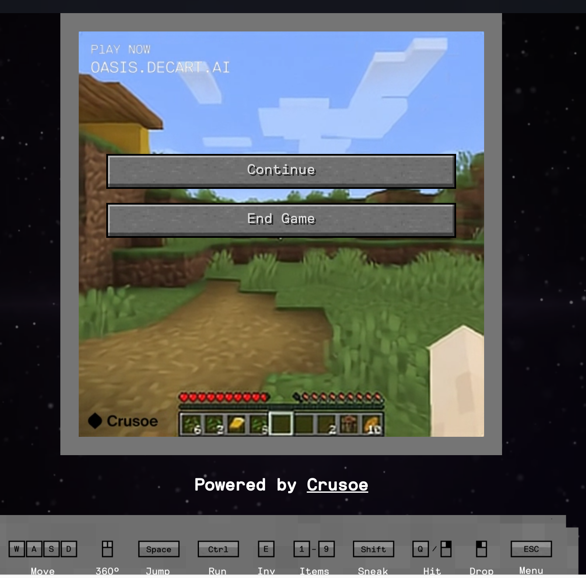

最近发现了个好玩的网站：[Oasis](https://oasis.decart.ai/). 引用其官网的介绍

> [Oasis is] a game engine trained by millions of gameplay hours. Every step you take will shape the environment around you in real time.

Oasis目前可以在电脑和手机的浏览器里游玩。目前一次可以玩5分钟，需要排队，不过队伍排地很快。体验下来，我觉得Oasis可以被概括为：给定一张Minecraft的游戏截图，用户输入指令（如WASD、左键破坏方块、丢弃物品），AI预测下一帧的游戏画面。

Oasis是否是Game Engine我认为仍然存疑，因为Game Engine应该更注重于游戏资源的管理、以及常用逻辑的实现。但Oasis的这一思路的确很有意思：“使用AI实时生成游戏画面”。虽然现在的成果还比较粗糙，但未来如果能加入一些更结构化的设计，或许真能打磨成一个很有意思的游戏。举个例子，或许Oasis可以用AI去预测方块在3D空间的位置，然后通过非AI的软件生成画面，而非像现在这样，由AI直接预测游戏画面。

以及，这一思路本身没准也能成为一种游戏，或许可以在Gamejam里试试看。

## 游戏体验

玩了一个小时，我发现Oasis竟然意外地很接近做梦，它很好地还原了梦里那种“眼前画面虽然很离谱，但又好像很合理”的感觉。

### 一些有意思的发现

- 如果向下挖一格，AI很有可能认为脚底下有一个巨大的深坑

- 如果能让眼前的画面全黑，那么就很有可能一直黑下去。

- AI有时会搞混天空和水底，前一秒在水底，后一秒可能仰头朝天了。应该说只要颜色接近，就有可能发生这种不合逻辑的“转场”。

- 如果想跨过去一个地面上的深坑，只要移动视角使深坑离开视野，再把视角移回来，深坑大概率就会变成平地

- 生物很少见，即使碰巧生成生物，它们也会很快渐变成方块或者直接消失。

- 打开物品栏、让物品栏遮住一部分视野、再关闭物品栏后，之前被遮住的部分很可能变成别的东西

- 任何东西离开视野就会变成别的东西。AI似乎不理解物体恒存。

### 现实解体

### 和非欧空间的关系

读别人的游戏体验时，有看到有人称Oasis为[非欧空间](https://en.wikipedia.org/wiki/Non-Euclidean_geometry)。我个人倒不是很想把Oasis归类到非欧空间。倒不如说这里根本就没有空间的概念。非欧空间只是公理不同于欧式空间，而且两者都有一个3D表示投影到2D屏幕的过程。但Oasis则是直接生成了2D的投影。作为对比，像[Hyperbolica](https://store.steampowered.com/app/1256230/Hyperbolica/)的游戏我认为才能被算作非欧空间。

<!-- ## 原理

## Genesis (CMU Robotics)

AI generate objects with physics simulation (AI-gen assets, existing physics sim), and AI-generated camera movement, instead of single image. Could be adapted to an AI game engine!

e.g. we can ask AI to generate a shopping mall or Mount Everest. -->