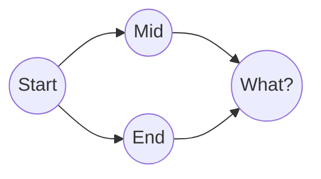

## Git Model

## Commonly Used Git Operations

### Stash all changes and Pop them later

`git stash` allows you to temporarily shelves your changes in the working directory, so you can work on something else, and come back to them later. This is useful if you want to switch branches or pull changes from a remote repository without committing your current changes.

By default, **tracked files** and **staged chagnes** (added by `git add`) are stashed. If specified, **untracked and ignored files** can also be stashed.

Below are commonly used commands related to stash

- Normal stashing

    ```bash
    git stash
    ```

- Stash untracked files

    ```bash
    git stash -u
    ```

- Stash untracked and ignored files

    ```bash
    git stash -a
    ```

- List stashes

    ```bash
    git stash list
    ```

    This will print something like this

    ```
    stash@{0}: On main: second stash, including untracked files
    stash@{1}: On main: first stash
    ```

    Note that `stash@{1}` is created earlier than `stash@{0}`, though its number is larger. This is because stash is maintained a stack, LIFO.

- Apply latest stash without removing it

    ```bash
    git stash apply
    ```

- Apply specific stash

    ```bash
    git stash apply stash@{0}
    ```

- Apply and drop latest stash

    ```bash
    git stash pop
    ```

- Apply and drop specific stash

    ```bash
    git stash pop stash@{0}
    ```

- Drop specific stash

    ```bash
    git stash drop stash@{0}
    ```

- Clear all stashes

    ```bash
    git stash clear
    ```

- Create a stash with a message

    ```bash
    git stash push -m "your message here"
    ```

- Stash only staged changes

    ```bash
    git stash --keep-index
    ```

- Stash only unstaged changes

    ```bash
    git stash --patch
    ```

### Walk on the commit tree

- Undo previous commit, make changes, and commit again

- Switch to

### Merge and Rebase



### Git Hook

E.g. Run linter on a Javascript project before each commit, and refuse to commit if linter check fails.
